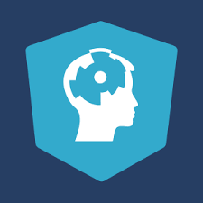

# Data Camp

Data Scientist with Python Career Track


[](http://commonmark.org)
[](http://hits.dwyl.com/OlegRyzhkov2020/eLearning_dataCamp)




## Data Camp Overview

DataCamp helps companies make better use of data. Our users acquire and maintain data fluency on the world’s most advanced data fluency platform. Because modern occupations require lifelong education, students learn continuously from the world’s top data experts. And they learn by doing—applying each lesson immediately, and responding to instant feedback. Our catalog includes hands-on coding courses in technologies like Python, R, and SQL; BI tools like Power BI and Tableau; spreadsheets and Excel; and theory courses like Data Science for Everyone.

```bash
http://www.datacamp.com
```

Current Projects:
+ TV, Halftime Shows, and the Big Game
+ The Android App Market on Google Play
+ The GitHub History of the Scala Language

## Contacts
[Find Me on
LinkedIn](https://www.linkedin.com/in/oleg-n-ryzhkov/)
